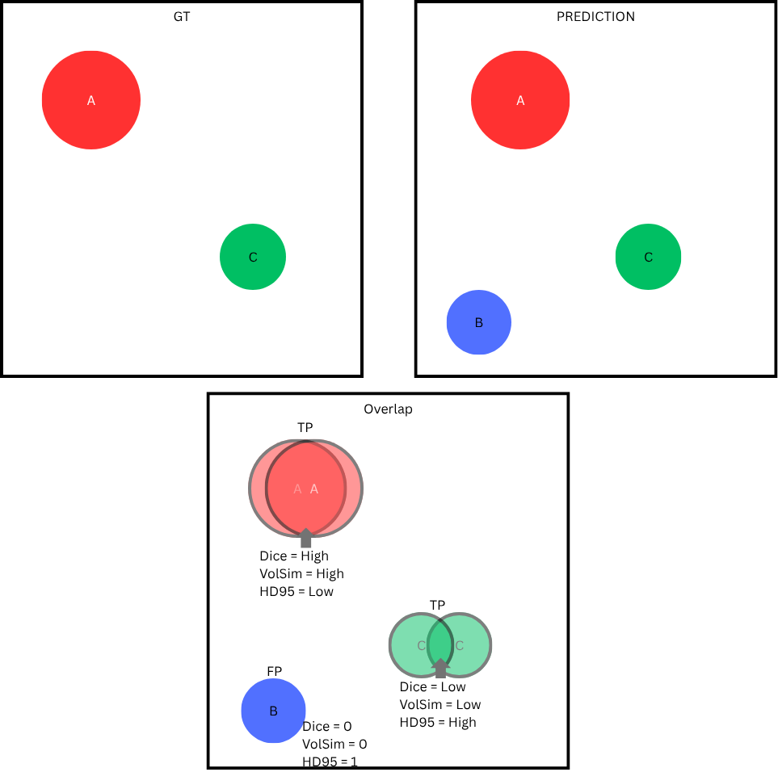

# TopAneu-26 Task 2 evaluation methodology

Task 2 is an instance segmentation task. Expected outputs are .mha volumes with the detected aneurysm locations. Evaluation metrics **Precision**, **Recall**, **Matthews Correlation Coefficient (MCC)**, **Dice Score (DSC)**, **Volumetric Similarity (VS)** and **Hausdorff Distance 95th precentile (HD95)** are computed for each class. Submissions are ranked by the average of these metrics across all classes. 

## Method
At evaluation time all TP, TN, FP, FN are computed for each class to obtain the classification evaluation. The GT and predicted masks are binarized for each class, a TP is present if the intersection is > 0, FN = the label is present in GT but not a TP, FP = the label is present in Pred but not a TP, TN = N labels in GT - (TP+FN).

Segmentation metrics are computed on a **volume** level, **disregarding instances**. The GT and Predictions are binarized for each class and the metrics are computed. **NOTE** Hausdorff distance is normalized by the diagonal of the image to make it more comparable, in case there is a FN/FP the HD is set to the max possible value (=1 since we normalize by diagonal). Segmentation metrics (DSC, VS, HD95) are only computed when either the GT or the Prediction contains instances of the respective class, otherwise they are counted as 0. To compute the global DSC, VS and HD95 within a given class it is accumulated over all samples and then normalized by the total count of TP, FN and FP in that class. This is done to avoid a bias in the results due to *perfect* all-zero predictions in TN classes.

**Example**:

If there are the *possible classes*=[A, B, C] with this segmentation layout:

     

That would result in:

- A: TP=1, FP=0, FN=0, TN=1
- B: TP=1, FP=0, FN=0, TN=1
- C: TP=0, FP=1, FN=0, TN=2

### Why are we not working on the instance level?
**In short**: to avoid ambiguity in edge cases. 
Evaluating on the instance level is feasible but needs many rules that make it less robust. For example if there is one big object overlapped with multiple small ones not all of the small ones can be TPs as that would inflate metrics which is avoided by evaluating on the volume level. Furthermore it is very unlikely for one case to have multiple instances of the same class (i.e. multiple aneurysms in the same location in this challenge).

## Metrics
**Precision** is computed for every class using:

$$
\text{Precision} = \frac{TP}{TP + FP}
$$

**Recall** is computed for every class using:

$$
\text{Recall} = \frac{TP}{TP + FN}
$$

**MCC** is computed for every class using:

$$
\text{MCC} = \frac{TN \times TP - FN \times FP}{\sqrt{(TP+FP)\times(TP+FN)\times(TN+FP)\times(TN+FN)}}
$$

**DSC** is computed for every class using:

$$
\text{DSC} = \frac{2 \times \lvert A \cap B \rvert}{\lvert A \rvert+\lvert B \rvert}
$$

**VS** is computed for every class using:

$$
\text{VS} = 1-\frac{\lvert \lvert A \rvert-\lvert B \rvert\rvert}{\lvert A\rvert+\lvert B\rvert}
$$

**HD95** is computed for every class as the:

95th percentile of the longest shortest bidirectional distance between two objects' surfaces.

## Ranking
Submissions are ranked by first computing the average of these metrics across all classes and then by the average of the resulting global Precision, Recall, MCC, Dice, Volsim and HD95.

## Simulations
The evaluation was tested with simulated data where random images with random spheres were generated and then evaluated under different prediciton conditions. These results as well as the script can be found in [test_evaluations](test_evaluations/).

**Experiments**

- all_correct: perfect results
  - Precision: 1.00
  - Recall: 1.00
  - MCC: 1.00
  - DSC: 1.00
  - HD95: 0.00
  - VS: 1.00
- all_zero: no results detected at all
  - Precision: 0.00
  - Recall: 0.00
  - MCC: 0.00
  - DSC: 0.00
  - HD95: 1.00
  - VS: 0.00
- all_one: results at matching locations but with different shapes and all predicted labels are 1
  - Precision: 0.00
  - Recall: 0.02
  - MCC: 0.00
  - DSC: 0.00
  - HD95: 1.00
  - VS: 0.00
- 50random50correct: 50% of the samples are perfect results the other are randomly placed spheres with random size and classes in the predictions
  - Precision: 0.47
  - Recall: 0.47
  - MCC: 0.45
  - DSC: 0.31
  - HD95: 0.68
  - VS: 0.31
- random-total: All predictions are randomly placed spheres with random size and classes
  - Precision: 0.00
  - Recall: 0.00
  - MCC: -0.02
  - DSC: 0.00
  - HD95: 0.99
  - VS: 0.00
- random-ps-rv: Perfect segmentations with random labels in every object
  - Precision: 0.02
  - Recall: 0.02
  - MCC: 0.00
  - DSC: 0.01
  - HD95: 0.98
  - VS: 0.01
- random-is-pv: Segmentations with random shapes at similar locations with perfectly correct labels
  - Precision: 1.00
  - Recall: 0.98
  - MCC: 0.99
  - DSC: 0.76
  - HD95: 0.03
  - VS: 0.76
- random-is-rv: Segmentations with random shapes at similar locations with random labels
  - Precision: 0.04
  - Recall: 0.04
  - MCC: 0.02
  - DSC: 0.01
  - HD95: 0.97
  - VS: 0.02
