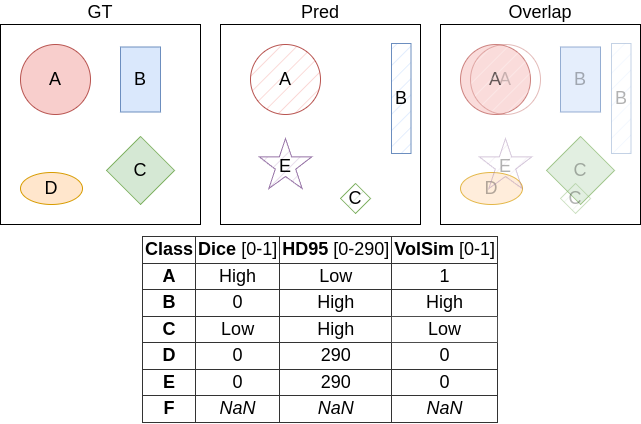

# TopAneu-26 Task 2 Evaluation

Task 2 is a multi-class image segmentation task. Expected outputs are .segmented aneurysms with location classes. Evaluation metrics are **Precision**, **Recall**, **Matthews Correlation Coefficient (MCC)**, **Dice Score (DICE)**, **Hausdorff Distance 95th Percentile (HD95)**, and **Volumetric Similarity (VOLSIM)** for each class. Submissions are ranked by the average of these metrics across all classes, ignoring NaN values.

## Method

The metrics are divided into two categories: classification and segmentation metrics.

The segmentation metrics (DICE, HD95, and VOLSIM) are computed for each class and averaged across images, ignoring NaN values. DICE and HD95 follow the same implementation as TopBrain 2025. Please refer to the test cases and individual metric documentation for further implementation details.

The segmentation masks are converted into detection counts (TP, TN, FP, FN) based on class presence with the ground-truth mask. These detection counts are then summed across all images.

The classification metrics (Precision, Recall, and MCC) are computed for each class from the aggregated detection counts, following the same procedure as Task 1. Division by zero results in NaN.

**Example**:

For these *possible classes*={A, B, C, D, E, F}, a case with the following gt and pred will be converted to Task1-compatible location-lists of *gt*=[A, B, C, D] and *predictions*=[A, B, C, E], and the segmentation metrics will be:



In this example, the most extreme metric values (i.e., the bounds) are reported as numerical values. Otherwise, "high" and "low" indicate relative values.

This example is also documented in the test case `test_evaluation_function_readme_example()` from [task2's `test_evaluate.py`](eval/task2/test_evaluations/test_evaluate.py)

## Ranking

For each metric, values are first averaged across images for each class. The resulting per-class averages are then averaged across all classes. Submissions are then ranked according to the average rank across these class-averaged metrics.

## Usage

### Folders `ground-truth/` and `predictions/`

When not in docker environment, you can put the prediction and ground-truth files in two subdirectories
`predictions/` and `ground-truth/` in the current directory and call `main.py` to get the evaluation results:

```sh
# mkdir and put your gt, pred like this:
├── ground-truth
├── predictions
├── main.py
```

_You can also point to any folder containing `ground-truth` and `predictions` subdirectories with the `--base_path` flag:_

```sh
# create a virtual env
python3.10 -m venv .venv
# activate
source .venv/bin/activate
# and install the dependencies (including topbrain25_eval)
pip install -r requirements.txt

# Outside of Docker, by default, main.py looks for files to evaluate in the current directory:
# in ./predictions/ and ./ground-truth/
python3 main.py

# You can override this with any folder containing the gt and pred sub-folders
python3 main.py --base_path <parent_dir_of_gt_pred_subdirs>
```

**The naming of gt and pred files can be arbitrary as long as their filenames are sorted in the same order.**

Supported formats are `.mha` and `.nii.gz` files.

The evaluation results are saved as a JSON file at **`<parent_dir_of_gt_pred_subdirs>/output/metrics.json`**.

### Docker for GC

Only for the organizers: the bash scripts in the repo are for setting up the repo as the evaluation Docker for evaluation on Grand-challenge (GC) platform.

## Testing

We provide test cases in [test_evaluations/](test_evaluations/) to document the code and verify its correctness. Run them from the project root using `pytest`:

```sh
python3 -m pytest test_evaluations/
```
